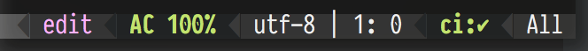

[WIP] github-ci-status
======================

Displays the current commit ci status in Emacs Mode Line.  
Works only with github repositories.  

This package is work in progress!!!
-----------------------------------
Remaining work:

- [ ] Create a proper package and publish to MELPA
- [ ] Make it work without spacemacs
- [ ] Add to spacemacs https://github.com/TheBB/spaceline/blob/master/spaceline-segments.el
- [ ] Integrate into magithub? https://github.com/vermiculus/magithub
- [ ] Automatically update status when switching project/repo without waiting for the timeout
- [ ] Make it configurable

Installation
------------------------------------
This package is still in progress and super lame.  
It currently works only in spacemacs.  

It requires [hub](https://hub.github.com) to be installed.  

For spacemacs:  
1. Add `github` to your `dotspacemacs-configuration-layers`  
2. Copy the contents of `github-ci-status.el` to your `dotspacemacs/user-config`  

screenshots
-----------
successful:  
  
failed:  
  
pending:  
  
